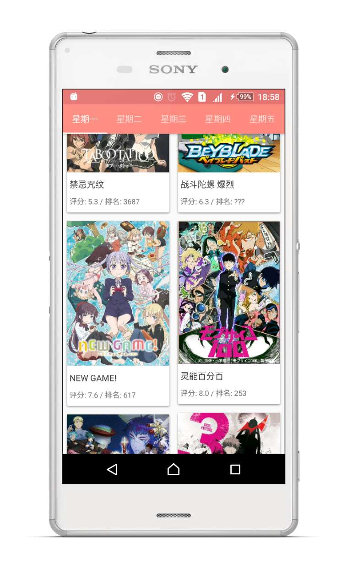
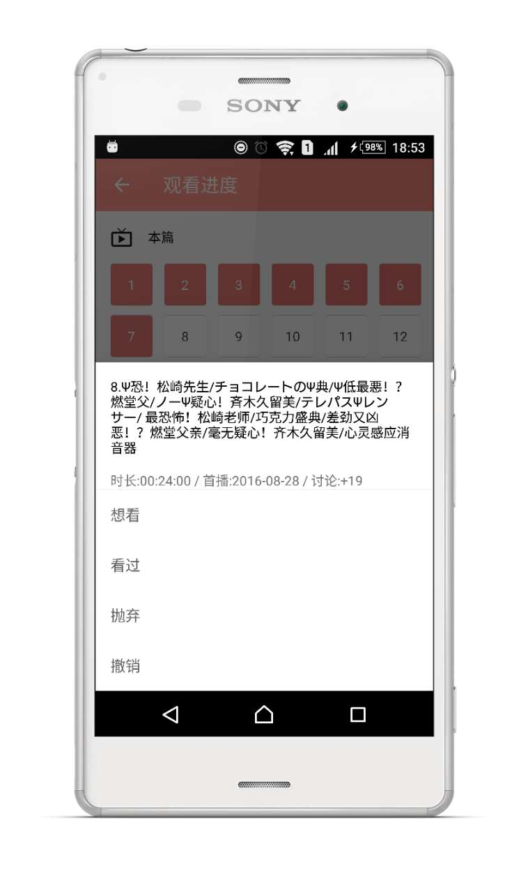

## Bgm38

A third part Android Client for  [Bangumi](http://bangumi.tv/) | [中文说明](http://zubinxiong.github.io/2016/08/18/bgm38/) 及 [中文QA](http://zubinxiong.github.io/2016/09/12/Bgm38%20%E8%B8%A9%E5%9D%91%E5%A4%87%E5%BF%98/)

If you find problem about this application, feel free to contact me via [weibo](http://weibo.com/xiongzba), [email](mailto:zubinxiong@gmail.com) or issuses. 

---

## Download

[CoolApk](http://coolapk.com/apk/me.ewriter.bangumitv)

[Google Play](https://play.google.com/store/apps/details?id=me.ewriter.bangumitv)

Google Play edition is under review, the lastest version please download from [Github Release](https://github.com/zubinxiong/Bgm38/releases) or CoolApk

---

### Preview

| 首页 | 超展开 | 我的进度 | 抽屉 | 关于 | 详情1| 搜索 | 详情2 |
|--- |---| ---| ---| ---| ---| ---| ---|
|  |  |  |  |  |  |  |  |  |

---

### Notice

- This project not contain a api resource, if you want to run this application,you can email me to get the api resource.

---

### Technology

- refactro to MVP + Retrofit + RxJava in v1.3. if you want to see old version use MVC your can use [tag](https://github.com/zubinxiong/Bgm38/tree/1.2.0) to see the old version
- Chrome Custom Tabs, GreenDao , SupportLibrary and some other open source library you can learn from this application 

---

### Todo

- ~~all type collection data. Finished~~
- ~~collection category switcher. Finished~~
- ~~user jsoup to fix the search only retrun few data problem. Finished~~
- search filter about anime, book, game, music, real
- mono page and category rank page
- group function need use orgin page instead of webView

---

### Thanks

- thanks scarletsky's project [Bangumi-Android](https://github.com/scarletsky/Bangumi-Android), some layout use his design

- the icon design by [奈白不弍](http://bangumi.tv/user/buernia)

---

### License

Apache License
